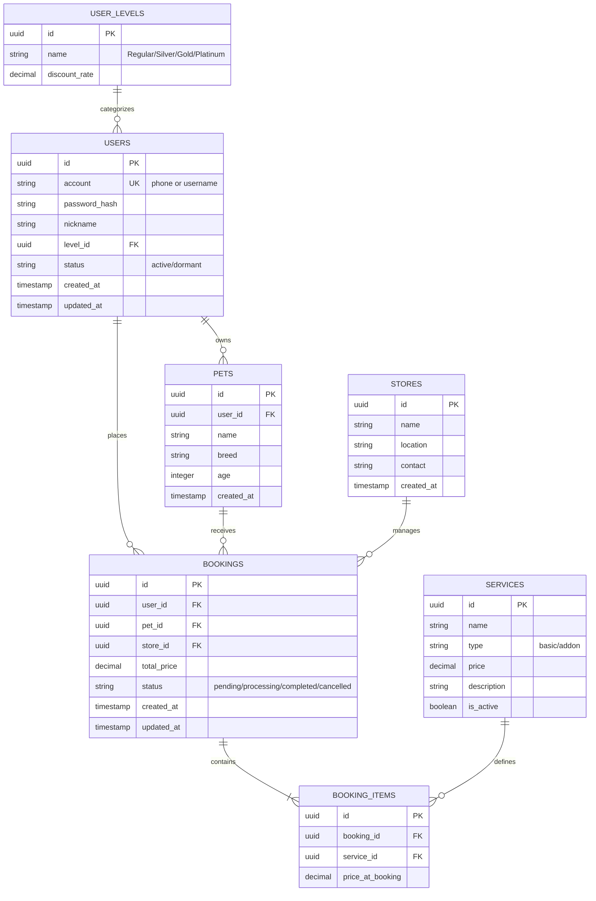

# PetCare AI 宠护平台 - 数据库设计文档 (PostgreSQL)

## 1. 概述
PetCare AI 平台采用 PostgreSQL 作为核心关系型数据库，用于存储用户、宠物、服务预约及运营管理数据。设计遵循第三范式，并针对高频预约场景进行了索引优化。

## 2. 实体关系图 (ERD)

## 3. 数据表详细设计

### 3.1 用户模块 (User Module)

#### `users` (用户表)
| 字段名 | 类型 | 约束 | 描述 |
| :--- | :--- | :--- | :--- |
| id | UUID | PRIMARY KEY | 用户唯一标识 |
| account | VARCHAR(50) | UNIQUE, NOT NULL | 登录账号 (手机号或用户名) |
| password_hash | VARCHAR(255) | NOT NULL | 密码哈希 |
| nickname | VARCHAR(50) | | 用户昵称 |
| level_id | UUID | FOREIGN KEY | 会员等级 ID |
| status | VARCHAR(20) | DEFAULT 'active' | 状态: active(活跃), dormant(沉睡) |
| created_at | TIMESTAMP | DEFAULT NOW() | 注册时间 |
| updated_at | TIMESTAMP | DEFAULT NOW() | 更新时间 |

#### `pets` (宠物表)
| 字段名 | 类型 | 约束 | 描述 |
| :--- | :--- | :--- | :--- |
| id | UUID | PRIMARY KEY | 宠物唯一标识 |
| user_id | UUID | FOREIGN KEY | 所属用户 ID |
| name | VARCHAR(50) | NOT NULL | 宠物昵称 |
| breed | VARCHAR(50) | | 品种 |
| age | INTEGER | | 年龄 (月) |
| created_at | TIMESTAMP | DEFAULT NOW() | 创建时间 |

### 3.2 服务与门店 (Service & Store)

#### `services` (服务定义表)
| 字段名 | 类型 | 约束 | 描述 |
| :--- | :--- | :--- | :--- |
| id | UUID | PRIMARY KEY | 服务唯一标识 |
| name | VARCHAR(100) | NOT NULL | 服务名称 (如：寄存2小时) |
| type | VARCHAR(20) | NOT NULL | 类型: basic(基础), addon(增值) |
| price | DECIMAL(10, 2) | NOT NULL | 标准售价 |
| description | TEXT | | 服务描述 |
| is_active | BOOLEAN | DEFAULT TRUE | 是否启用 |

#### `stores` (门店表)
| 字段名 | 类型 | 约束 | 描述 |
| :--- | :--- | :--- | :--- |
| id | UUID | PRIMARY KEY | 门店唯一标识 |
| name | VARCHAR(100) | NOT NULL | 门店名称 |
| location | VARCHAR(255) | | 详细地址 |
| contact | VARCHAR(50) | | 联系电话 |

### 3.3 预约模块 (Booking Module)

#### `bookings` (预约主表)
| 字段名 | 类型 | 约束 | 描述 |
| :--- | :--- | :--- | :--- |
| id | UUID | PRIMARY KEY | 预约号 |
| user_id | UUID | FOREIGN KEY | 下单用户 ID |
| pet_id | UUID | FOREIGN KEY | 受理宠物 ID |
| store_id | UUID | FOREIGN KEY | 关联门店 ID |
| total_price | DECIMAL(10, 2) | NOT NULL | 订单总金额 |
| status | VARCHAR(20) | NOT NULL | 状态: pending, processing, completed, cancelled |
| created_at | TIMESTAMP | DEFAULT NOW() | 下单时间 |
| updated_at | TIMESTAMP | DEFAULT NOW() | 状态更新时间 |

#### `booking_items` (预约明细表)
| 字段名 | 类型 | 约束 | 描述 |
| :--- | :--- | :--- | :--- |
| id | UUID | PRIMARY KEY | 明细 ID |
| booking_id | UUID | FOREIGN KEY | 关联预约 ID |
| service_id | UUID | FOREIGN KEY | 关联服务 ID |
| price_at_booking | DECIMAL(10, 2) | NOT NULL | 下单时单价 (快照) |

### 3.4 索引策略
- `idx_users_phone`: 针对手机号登录的唯一索引。
- `idx_bookings_user_id`: 针对用户查询个人订单的索引。
- `idx_bookings_status_store`: 针对后台管理多条件筛选的复合索引。
- `idx_booking_items_booking_id`: 针对订单详情查询的索引。

## 4. 实时计价逻辑 (数据库触发器/视图)
实时计价建议由后端应用层计算，但数据库通过 `price_at_booking` 记录快照，确保订单生成后价格不受服务调价影响。
