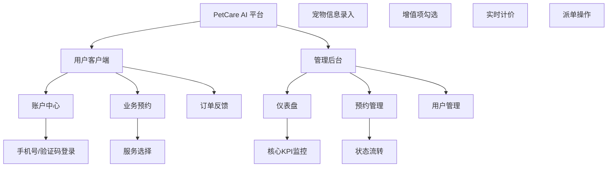

# PetCare AI 宠护平台 - 产品需求文档 (PRD)

## 1. 文档信息
- **版本**: v1.0
- **状态**: 草案
- **最后更新日期**: 2026-03-25
- **修订记录**:
  - v1.0: 初始版本，基于杭州试点高保真原型分析。

## 2. 产品概述
- **产品名称**: PetCare AI 宠护平台
- **产品定位**: 面向城市养宠人群的高频低价、极简交互的标准化宠护服务平台。
- **产品愿景**: 通过 AI 驱动的自动化调度与透明化履约，重新定义城市宠护服务效率。
- **核心价值主张**: 
  - **高效**: 3 步完成预约，实时价格预估。
  - **透明**: 履约状态全链路可感知，AI 自动派单透明公正。
  - **极致体验**: 极简深色模式 UI，支持多端自适应。
- **目标平台**:
  - **移动端 (Web/WeChat)**: 375px/414px 响应式断点，核心用户操作端。
  - **平板端 (Tablet)**: 768px 断点，用于门店前台或移动管理。
  - **桌面端 (Desktop)**: 1440px 断点，核心管理后台，处理大数据与复杂逻辑。
- **核心假设**:
  - 用户追求极致的下单效率而非复杂的社交功能。
  - 标准化服务（基础+增值）能覆盖 80% 以上的日常宠护需求。
  - 深色模式能提升专业感并降低长时间使用的视觉疲劳。

## 3. 用户研究
### 3.1 核心画像
- **画像 A：忙碌的职场铲屎官 (Alice)**
  - **特征**: 25-35 岁，互联网/金融行业，居住在杭州核心区。
  - **需求**: 希望在通勤路上或工作间隙快速完成宠物洗护预约。
  - **痛点**: 传统预约电话难打、确认慢、价格不透明。
- **画像 B：门店调度管理员 (Bob)**
  - **特征**: 30-45 岁，宠物店店长或区域调度。
  - **需求**: 实时监控订单流入，快速分配资源，分析经营指标。
  - **痛点**: 手工登记易出错，人效难以统计，预算偏差大。

### 3.2 核心场景
- **场景 1 (极速预约)**: Alice 打开手机，输入宠物昵称，选定“精细洗护”+“剪趾甲”，看到总价 ¥158，点击提交，1秒后收到“待派单”反馈。
- **场景 2 (后台调度)**: Bob 在电脑端看到新增 10 笔订单，通过仪表盘发现“杭州一店”人力饱和，一键操作将 3 笔订单流转至邻近门店。

## 4. 市场与竞争分析
- **市场趋势**: 宠物经济持续升温，用户对服务质量的要求从“能用”转向“高效”与“标准化”。
- **竞争策略**:
  - **差异化**: 相比传统 App 的沉重，PetCare 采用“极简路径”与“状态优先”策略。
  - **技术领先**: 预留 AI 智能派单接口，支持多智能体协作。

## 5. 功能需求
### 5.1 功能架构图

### 5.2 核心功能描述
| 模块 | 功能点 | 描述 | 验收标准 (AC) |
| :--- | :--- | :--- | :--- |
| **预约** | 实时计价引擎 | 根据所选基础服务和增值项实时更新总价。 | 勾选/取消增值项，总价变化延迟 < 100ms。 |
| **预约** | 极速提交 | 支持宠物信息快速填充，一键提交。 | 必填项检查正确，提交后 1s 内进入“待派单”状态。 |
| **后台** | 仪表盘看板 | 展示订单量、客单价、复购率、预算偏差。 | 数据实时刷新，支持同比/环比展示。 |
| **后台** | 订单流转 | 支持“待派单”到“处理中”到“已完成”的手动/自动流转。 | 状态切换触发系统通知，记录变更时间戳。 |

## 6. 交互设计规范 (基于 Design Spec)
- **Design Token**: 严格遵循 `tokens.css`，主色 `#22C55E`，背景 `#070B14`。
- **响应式**: 四断点自适应，移动端优先。
- **反馈**: 按钮具备加载态 (Loading) 与成功/失败状态反馈。

## 7. 技术架构建议
- **前端**: React/Vue3 + Tailwind CSS (用于快速实现 Token 系统)。
- **后端**: Node.js/Python FastAPI，支持高并发预约请求。
- **存储**: Redis (实时订单状态) + PostgreSQL (结构化数据)。
- **AI 协作**: 预留 JSON-RPC 接口，支持多智能体进行自动化订单分析与异常预警。

## 8. 成功指标 (North Star Metric)
- **北极星指标**: **月度成功履约订单量 (Monthly Completed Orders)**。
- **次要指标**: 预约转化率、平均派单耗时、用户 30 天复购率。

## 9. 验收标准
- [ ] 页面符合 8pt 栅格系统。
- [ ] 四断点自适应无布局崩溃。
- [ ] 关键流程 (注册、下单) 3 步内完成。
- [ ] 符合 WCAG 2.1 AA 可访问性标准。
